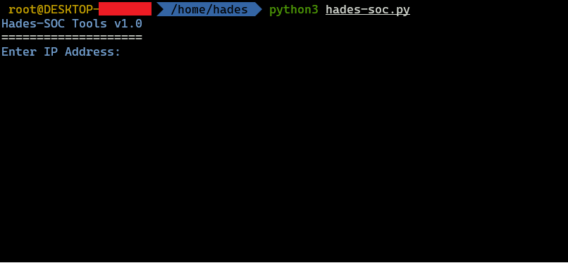
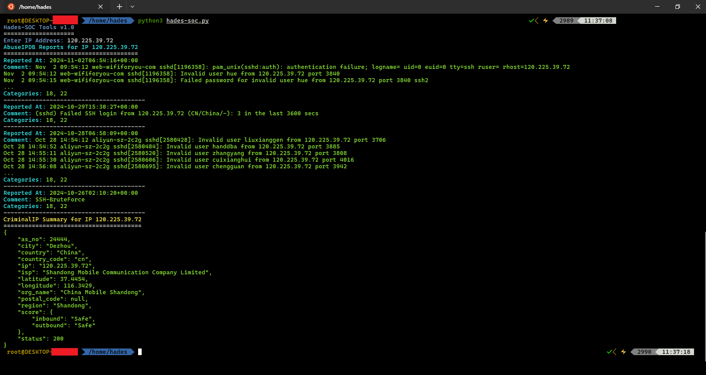

# Hades-SOC

Description: Hades-Soc Tools is a cybersecurity application designed to help IT professionals and security teams check the reputation and potential malicious activity of suspicious IP addresses. It combines two leading APIs-AbuseIPDB and CriminalIP-to provide a clear picture of whether an IP has been involved in malicious activity, such as DDoS attacks, spam, or other network attacks.

# By using Hades-Soc Tools, users can:
- Verify IP Reputation: Using AbuseIPDB, this tool allows you to check if an IP address has been reported for suspicious or malicious activity in the last 90 days.
- Assess Potential Involvement in Criminal Activity: CriminalIP provides a more in-depth analysis of whether the IP is involved in cybercrime, including malware attacks or distribution.
- Conduct Precise Analysis: These tools allow network owners or organizations to identify potential threats, take preventative measures, and make faster decisions regarding security and risk management.
- Improving Network Security: By leveraging data from two powerful services, Hades-Soc Tools help SOC (Security Operation Center) teams and security professionals to mitigate threats arising from infected or misused IP.

# Key Features:
- AbuseIPDB Report: Provides up-to-date data on IP abuse reports in various threat categories.
- CriminalIP Summary: Provides a complete overview of IP involvement in criminal activity and potential risks to your organization.
- Easy to Use Interface: Allows users to enter an IP address and instantly get easy-to-understand analysis results.

# Suitable for:
Network security professionals and teams
System and cybersecurity administrators
Users who want to analyze suspicious IP addresses

With Hades-Soc Tools, you can quickly and easily analyze suspicious IPs, strengthen network defenses, and reduce the potential risk of outside threats.
